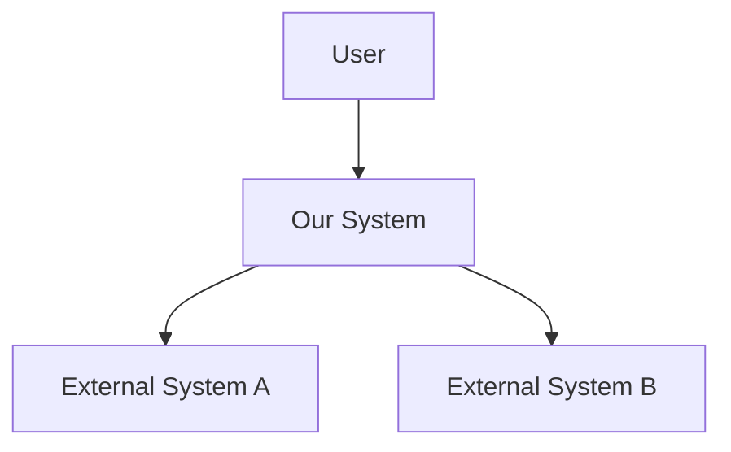
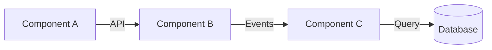

# Skill: Architecture Design

## Purpose

Design robust system architectures by evaluating trade-offs, defining components and interfaces, and documenting decisions. Use this skill when making structural decisions about how a system should be organized.

## When to Use

- Designing a new system or major feature
- Evaluating architectural alternatives
- Defining component boundaries and interfaces
- Making technology selection decisions
- Documenting architecture decisions (ADRs)

## Techniques

### 1. C4 Model (Context, Container, Component, Code)

**Level 1 — System Context**: Who uses the system and what external systems does it interact with?
**Level 2 — Containers**: What are the major deployable units (apps, databases, queues)?
**Level 3 — Components**: What are the key modules/services within each container?
**Level 4 — Code**: Class/function-level design (only when needed)

### 2. Quality Attribute Workshop

For each critical quality attribute:
| Attribute | Scenario | Measure | Priority |
|---|---|---|---|
| Performance | [Stimulus → Response] | [Target metric] | |
| Scalability | [Growth scenario] | [Capacity target] | |
| Security | [Threat scenario] | [Control measure] | |
| Availability | [Failure scenario] | [Uptime target] | |

### 3. Trade-off Analysis

| Option | Pros | Cons | Complexity | Risk | Recommendation |
|---|---|---|---|---|---|
| A | | | | | |
| B | | | | | |

### 4. ADR (Architecture Decision Record) Format

```markdown
## ADR-XXX: [Title]

**Date**: YYYY-MM-DD
**Status**: Proposed / Accepted / Deprecated / Superseded

### Context
[What is the situation and why do we need to make a decision?]

### Options Considered
1. **Option A** — [Description]
2. **Option B** — [Description]

### Decision
We will go with **Option [X]** because [rationale].

### Consequences
**Positive:**
- 

**Negative:**
- 

**Trade-offs:**
- 

### Related
- [Links to related ADRs or documents]
```

## Diagram Templates

### System Context (Mermaid)


### Component Diagram (Mermaid)

